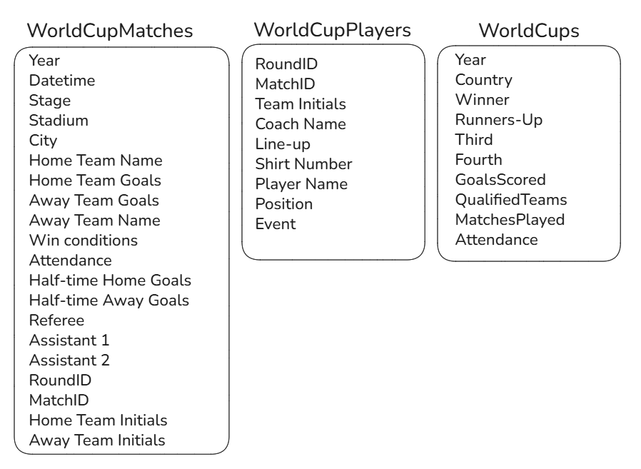
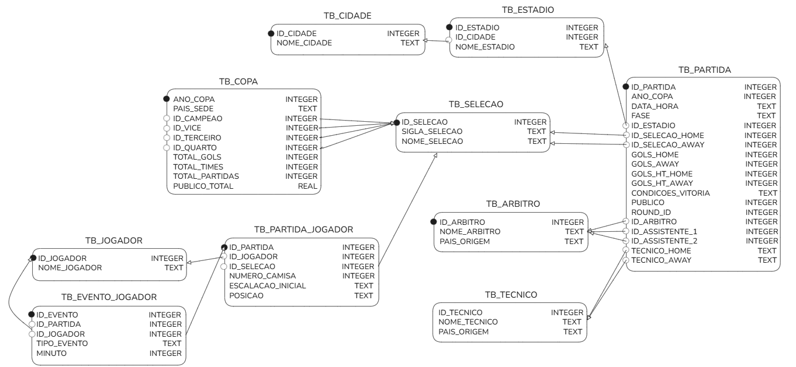

# Portfólio SQL: Engenharia Reversa, Normalização e Análise Histórica da Copa do Mundo

Este repositório contém o desenvolvimento completo do projeto final da disciplina de Banco de Dados. O objetivo principal do projeto é aplicar conceitos de engenharia reversa e normalização de dados sobre um conjunto de dados brutos e desorganizados, seguido pelo desenvolvimento de um ecossistema analítico contendo 15 consultas.

---

## 🚀 Exploração Interativa (Google Colab)

Para tornar a experiência de visualização e análise o mais ágil e acessível possível, todo o pipeline de dados — desde a extração dos dados brutos, engenharia reversa, tratamento com Pandas, até a execução visual das 15 consultas analíticas — foi centralizado em um Jupyter Notebook interativo. 

Isso elimina a necessidade de clonar o repositório ou configurar um ambiente local (como Python, bibliotecas e SQLite) para validar os resultados. Você pode abrir, inspecionar e executar o projeto completo diretamente no seu navegador clicando no botão abaixo:

[](https://colab.research.google.com/drive/1ChmsCFfvE5S50oTfj_RiDCEscVS05MGB?usp=sharing)

---

## 📂 Estrutura de Diretórios do Repositório

```text
├── AB2_FINAL.ipynb           # Notebook completo com todo o pipeline (ETL + Queries)
├── database/                 # Diretório centralizador do ecossistema relacional
│   ├── copa_do_mundo.db      # Banco de Dados SQLite já estruturado e populado
│   └── queries/              # Scripts puros encapsulados por requisito
│       ├── 1-query.sql      # Script individual da Consulta 1
│       ├── 2-query.sql      # Script individual da Consulta 2
│       └── [..]              # Demais arquivos de script .sql até a 15-query.sql
└── datacamp-certificates/    # Pasta contendo os PDFs comprobatórios de nivelamento
    └── [..]

```

---

## 📐 O Antes e o Depois: Processo de Normalização

### O Desafio dos Dados Brutos (Denormalizados)

Os arquivos CSV originais extraídos do Kaggle continham anomalias clássicas de sistemas não-relacionais, misturando múltiplos domínios em um único registro. Informações de estádios, cidades, árbitros e gols eram repetidas de forma puramente textual em milhares de linhas, gerando redundância severa e risco latente de inconsistência em atualizações.



### Mapeamento do Esquema Relacional Otimizado (1FN, 2FN e 3FN)

Para sanar esses problemas e garantir a integridade referencial, os dados textuais foram atomizados e distribuídos em 10 tabelas lógicas controladas por restrições de integridade:



1. **TB_SELECAO:** `ID_SELECAO` (PK), `SIGLA_SELECAO`, `NOME_SELECAO` (Unique).
2. **TB_CIDADE:** `ID_CIDADE` (PK), `NOME_CIDADE` (Unique).
3. **TB_ESTADIO:** `ID_ESTADIO` (PK), `NOME_ESTADIO`, `ID_CIDADE` (FK).
4. **TB_ARBITRO:** `ID_ARBITRO` (PK), `NOME_ARBITRO` (Unique), `PAIS_ORIGEM`.
5. **TB_TECNICO:** `ID_TECNICO` (PK), `NOME_TECNICO`, `PAIS_ORIGEM` (Unique Composite).
6. **TB_COPA:** `ANO_COPA` (PK), `PAIS_SEDE`, `ID_CAMPEAO` (FK), `ID_VICE` (FK), `ID_TERCEIRO` (FK), `ID_QUARTO` (FK), `TOTAL_GOLS`, `TOTAL_TIMES`, `TOTAL_PARTIDAS`, `PUBLICO_TOTAL`.
7. **TB_PARTIDA:** `ID_PARTIDA` (PK), `ANO_COPA` (FK), `DATA_HORA`, `FASE`, `ID_ESTADIO` (FK), `ID_SELECAO_HOME` (FK), `ID_SELECAO_AWAY` (FK), `GOLS_HOME`, `GOLS_AWAY`, `GOLS_HT_HOME`, `GOLS_HT_AWAY`, `CONDICOES_VITORIA`, `PUBLICO`, `ROUND_ID`, `ID_ARBITRO` (FK), `ID_ASSISTENTE_1` (FK), `ID_ASSISTENTE_2` (FK), `ID_TECNICO_HOME` (FK), `ID_TECNICO_AWAY` (FK).
8. **TB_JOGADOR:** `ID_JOGADOR` (PK), `NOME_JOGADOR`.
9. **TB_PARTIDA_JOGADOR:** `ID_PARTIDA` (PK/FK), `ID_JOGADOR` (PK/FK), `ID_SELECAO` (FK), `NUMERO_CAMISA`, `ESCALACAO_INICIAL`, `POSICAO`.
10. **TB_EVENTO_JOGADOR:** `ID_EVENTO` (PK), `ID_PARTIDA` (FK), `ID_JOGADOR` (FK), `TIPO_EVENTO`, `MINUTO`.

---

## 📊 Dossiê das 15 Consultas Analíticas (Fator Inovação)

As consultas abaixo evitam métricas óbvias ou relatórios pré-fabricados de internet, extraindo correlações e curiosidades históricas que exploram junções (`INNER`/`LEFT JOIN`), agregações (`SUM`, `AVG`, `MAX`, `MIN`, `COUNT`), partições filtradas (`GROUP BY`/`HAVING`), ordenações explícitas e limites.

| N° | Pergunta de Negócio / Objetivo da Consulta | Justificativa Técnica do Critério de Inovação |
| --- | --- | --- |
| **01** | Técnicos nacionais conquistam uma média de gols pró maior ou menor nas partidas em comparação a técnicos estrangeiros? | Consolida as perspectivas de mando via `UNION ALL` e avalia estatisticamente o impacto cultural na ofensividade usando agrupamentos agregados. |
| **02** | Quais técnicos comandaram o maior número de seleções diferentes ao longo da história e o total de partidas acumuladas? | Isola os treinadores "nômades" da história das Copas filtrando exclusividades geográficas por meio do operador agregador `HAVING COUNT(DISTINCT)`. |
| **03** | Quais técnicos estreantes em Copas conseguiram golear (vitória por 3+ gols) logo em sua primeira partida registrada? | Calcula a estreia absoluta em subquery (`WITH`) usando `MIN()` e cruza dinamicamente com dados cronológicos e funções matemáticas (`ABS`). |
| **04** | Quais estádios registraram a maior média de gols por partida, considerando apenas jogos decisivos (Semifinal/Final) com pelo menos 2 partidas sediadas? | Filtra o clímax emocional do torneio e usa restrição por volume (`HAVING COUNT >= 2`) para analisar a efetividade ofensiva sob extrema pressão psicológica. |
| **05** | Quais cidades históricas concentraram o maior número de partidas de Copa sem repetir o mesmo estádio? | Analisa infraestrutura e logística de centros urbanos com múltiplos estádios, monitorando ciclos temporais com funções `MIN` e `MAX`. |
| **06** | Em quais partidas das fases eliminatórias registrou-se o público mais baixo da história do torneio, e quais seleções estavam em campo? | Inverte o padrão comum de recordes máximos e busca anomalias em fases agônicas usando negações complexas (`NOT LIKE`) e aliasing múltiplo de tabelas. |
| **07** | Quais jogadores marcaram gols na história das Copas tendo entrado na partida estritamente como substitutos reservas? | Mede o impacto imediato das alterações do comando técnico cruzando a entidade fraca de eventos com estados lógicos de banco (`ESCALACAO_INICIAL = 'S'`). |
| **08** | Agrupando os atletas por sua posição, qual setor do campo apresentou a maior média de minutos em que ocorrem seus respectivos eventos (gols/cartões)? | Reclassifica dados brutos setoriais em tempo de execução via `CASE WHEN` para mapear o comportamento cronológico-disciplinar médio por setor. |
| **09** | Existem numerações de camisa específicas que historicamente acumulam mais cartões (amarelos/vermelhos) do que gols? | Aplica somatórios condicionais avançados (`SUM(CASE WHEN)`) para segregar tipos de eventos em uma mesma coluna textual, isolando camisas indisciplinadas. |
| **10** | Quais seleções marcaram a maior quantidade de gols nos primeiros 10 minutos de jogo (gols relâmpago) em fases de mata-mata? | Explora a intensidade inicial de jogos cruciais limpando strings complexas de eventos nativamente (`REPLACE`/`SUBSTR`) e convertendo-as para avaliação inteira. |
| **11** | Quais jogadores marcaram gols decisivos no "estouro do cronômetro" (após min 85) em partidas decididas por apenas 1 gol de diferença? | Mapeia os heróis das Copas sob alta pressão. Tratado rigorosamente com agrupamentos complexos para anular redundâncias caso o atleta marque duas vezes. |
| **12** | Quais seleções conseguiram a façanha de terminar exatamente na mesma posição de pódio em edições consecutivas? | Identifica dinastias de pódios executando um auto-relacionamento (`INNER JOIN` reflexivo) com base em um deslocamento temporal preciso de 4 anos (`+ 4`). |
| **13** | Qual seleção campeã mundial conquistou o título com a menor média de gols marcados por partida ao longo de sua campanha? | Isola o "campeão do pragmatismo", localizando a equipe com a menor média ofensiva agregada calculada dinamicamente com base em sua condição de campo. |
| **14** | Em quais edições a seleção com o melhor ataque geral acabou não terminando sequer entre os 4 primeiros colocados do torneio? | Explora o paradoxo competitivos fazendo uso acadêmico de junções externas (`LEFT OUTER JOIN`), rastreando ausências de pódio via validação de nulos (`IS NULL`). |
| **Aux** | *Relatório Complementar de Auditoria:* Histórico cruzado lado a lado de todos os campeões e os melhores ataques de cada ano. | *Query auxiliar de validação empírica elaborada após a Consulta 14 comprovar estatisticamente que o melhor ataque sempre atinge o Top 4 na história.* |
| **15** | Qual seleção acumulou mais aparições no Top 4, mas possui a menor taxa proporcional de conversão em títulos mundiais? | Evidencia os "vices históricos" forçando aritmética de ponto flutuante via SQLite (`* 1.0`), combinando ordenações inversas de volume e aproveitamento. |

---

## 📹 Vídeo de Demonstração

https://github.com/user-attachments/assets/f399cb5a-1585-41e4-87fa-4ffe2f440bc1

---

## 🎓 Módulos de Nivelamento (Certificados DataCamp)

Como requisito de proficiência técnica inicial e nivelamento exigido para a aprovação na matéria, a pasta `/datacamp-certificates` abriga os certificados individuais em PDF dos seguintes cursos concluídos:

* **Curso 1:** [*Introduction to Relational Databases in SQL*](datacamp-certificates/introduction-sql.pdf) (Carga horária: 2 horas)
* **Curso 2:** [*Intermediate SQL*](datacamp-certificates/intermediate-sql.pdf) (Carga horária: 4 horas)
* **Curso 3:** [*Joining Data in SQL*](datacamp-certificates/joining-data.pdf) (Carga horária: 4 hours)
* **Curso 4:** [*Applying SQL to Real-World Problems*](datacamp-certificates/applying-sql-real-problems.pdf) (Carga horária: 4 hours)


